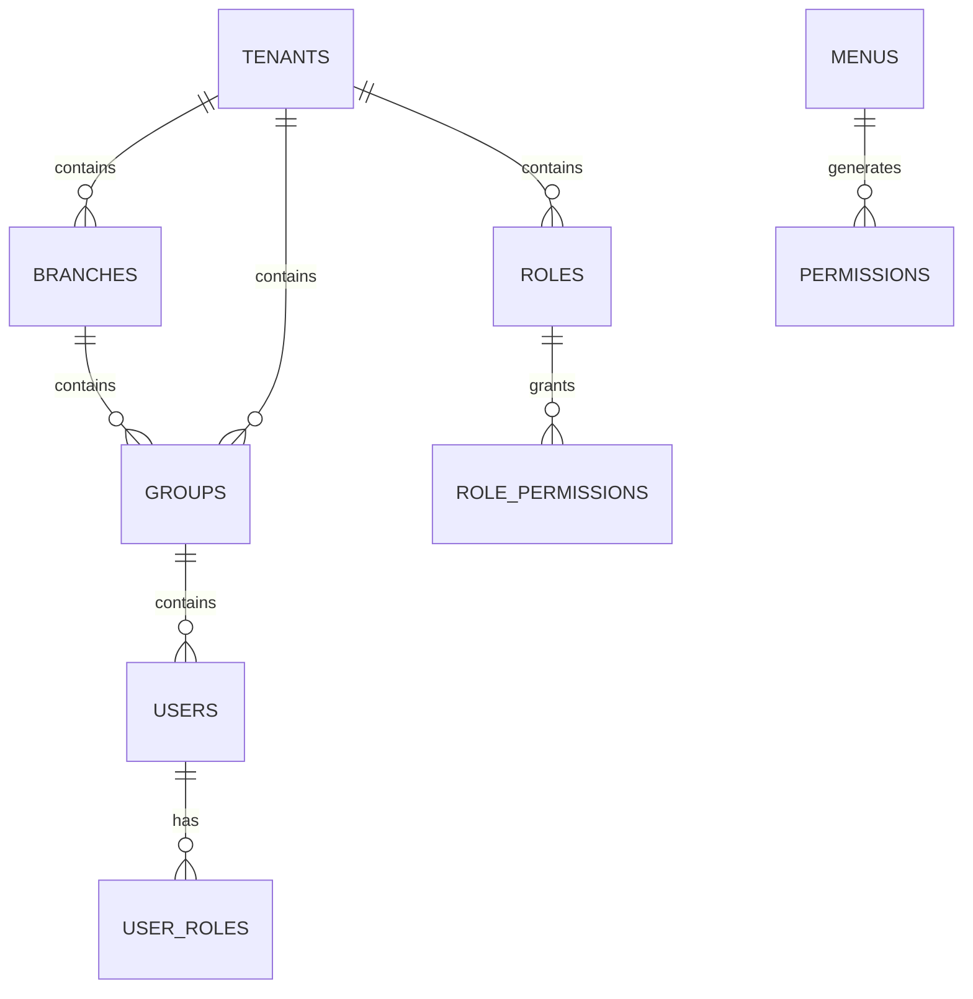

# Feature: Overview & Architecture

## 1. Executive Summary
**crm-project** is a multi-tenant CRM dashboard built on eGovFrame 5.0 Beta (Spring Boot 3.2.x). It features strict tenant isolation, automated permission generation, and a hierarchical organizational structure.

### Key Features
- **Multi-tenancy**: Strict data isolation at PostgreSQL level.
- **Automated Permissions**: Menu-driven permission auto-generation.
- **Advanced RBAC**: Granular permissions with multiple role assignments.
- **Hierarchy**: Tenant → Branch → Group → Position → User.

## 2. Architecture & Tech Stack

### Tech Stack
- **Framework**: eGovFrame 5.0 (Spring Boot 3.x)
- **Language**: Java 17
- **Database**: PostgreSQL (JPA/Hibernate 6.x)
- **Frontend**: React 19.2 + shadcn/ui
- **Build**: Gradle

### Core Entity Relationships


# Feature: Multi-Tenancy

## 1. Core Rules
- **Strict Isolation**: All data must be isolated by `TENANT_ID`.
- **Filtering**: Application-level filtering via Hibernate `@Filter` is primary; RLS is secondary/optional.
- **Context**: `TenantContext` (ThreadLocal) holds the current tenant ID from the authenticated user.

## 2. Schema Design regarding Multi-tenancy
All tables MUST have `TENANT_ID` and standard audit fields.

### Standard Tenant Table
```sql
CREATE TABLE TENANTS (
    TENANT_ID VARCHAR(20) NOT NULL PRIMARY KEY,
    TENANT_NAME VARCHAR(100),
    USE_AT CHAR(1) DEFAULT 'Y'
    -- ... audit fields
);
```

### Tenant Filter Implementation
**Rule**: Use `TenantContext` to set the Hibernate filter parameter.

```java
@Entity
@FilterDef(name = "tenantFilter", parameters = @ParamDef(name = "tenantId", type = String.class))
@Filter(name = "tenantFilter", condition = "TENANT_ID = :tenantId")
public class BaseTenantEntity {
    @Column(name = "TENANT_ID", nullable = false, updatable = false)
    private String tenantId;
}
```

## 3. Tenant Context Aspect
**Rule**: Intercept service/repository calls or Web requests to set the filter.

```java
// Logic:
// 1. Get Authentication from SecurityContext
// 2. Extract tenantId from CustomUserDetails
// 3. Enable "tenantFilter" on Hibernate Session
```

# Feature: Permission & Menu System

## 1. Menu-Driven Permission Auto-Generation
**Rule**: System automatically generates permissions when a Menu is created/updated.

### Mechanism
- **Trigger**: JPA Entity Listener (`@PostPersist`, `@PostUpdate`) on `Menu` entity.
- **Naming Convention**:
    - **API**: `API:{menuCode}:{action}` (Action: READ, WRITE, etc.)
    - **MENU**: `MENU:{menuCode}:{action}` (Action: READ)

### Rules
1. **Menu → API**: If `apiEndpoint` exists, create `API` type permission.
2. **Menu → UI**: ALWAYS create `MENU` type permission for UI access control.
3. **Synchronization**: Updates to Menu Code/Paths must propagate to Permissions.

## 2. Schema Definitions

### Menus
```sql
CREATE TABLE MENUS (
    MENU_NO BIGINT AUTO_INCREMENT PRIMARY KEY,
    MENU_CODE VARCHAR(50) UNIQUE,
    MENU_PATH VARCHAR(255),
    API_ENDPOINT VARCHAR(255),
    IS_VISIBLE CHAR(1) DEFAULT 'Y',
    TENANT_ID VARCHAR(20) NOT NULL
);
```

### Permissions (Auto-Generated)
```sql
CREATE TABLE PERMISSIONS (
    PERMISSION_ID BIGINT AUTO_INCREMENT PRIMARY KEY,
    PERMISSION_CODE VARCHAR(100) NOT NULL,
    PERMISSION_TYPE VARCHAR(20) NOT NULL, -- 'API', 'MENU'
    PERMISSION_ACTION VARCHAR(20) NOT NULL,
    RESOURCE_PATH VARCHAR(255),
    MENU_NO BIGINT, -- Source menu
    UNIQUE (PERMISSION_CODE, PERMISSION_TYPE, PERMISSION_ACTION, TENANT_ID)
);
```

### Role-Permissions (M:N)
```sql
CREATE TABLE ROLE_PERMISSIONS (
    ROLE_ID VARCHAR(20) NOT NULL,
    PERMISSION_ID BIGINT NOT NULL,
    TENANT_ID VARCHAR(20) NOT NULL,
    UNIQUE (ROLE_ID, PERMISSION_ID, TENANT_ID)
);
```

## 3. Audit Logging
Record all permission checks (Access/Denial).

```sql
CREATE TABLE PERMISSION_AUDIT_LOG (
    LOG_ID BIGINT AUTO_INCREMENT PRIMARY KEY,
    USER_ID VARCHAR(20),
    PERMISSION_ID BIGINT,
    ACTION VARCHAR(50),
    STATUS VARCHAR(20), -- SUCCESS, DENIED
    ACCESS_TIME TIMESTAMP DEFAULT CURRENT_TIMESTAMP
);
```

