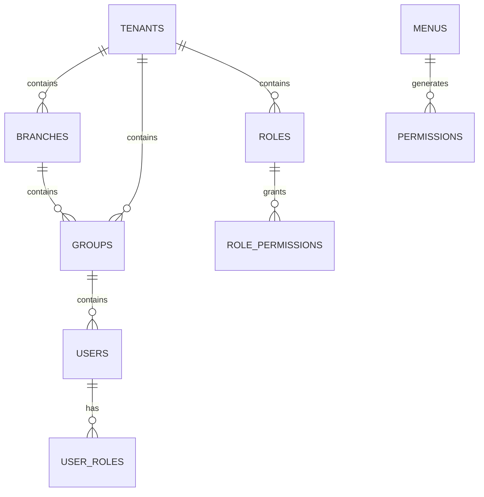

# Feature: Overview & Architecture

## 1. Executive Summary
**crm-project** is a multi-tenant CRM dashboard built on eGovFrame 5.0 Beta (Spring Boot 3.2.x). It features strict tenant isolation, automated permission generation, and a hierarchical organizational structure.

### Key Features
- **Multi-tenancy**: Strict data isolation at PostgreSQL level.
- **Automated Permissions**: Menu-driven permission auto-generation.
- **Advanced RBAC**: Granular permissions with multiple role assignments.
- **Hierarchy**: Tenant → Branch → Group → Position → User.

## 2. Architecture & Tech Stack

### Tech Stack
- **Framework**: eGovFrame 5.0 (Spring Boot 3.x)
- **Language**: Java 17
- **Database**: PostgreSQL (JPA/Hibernate 6.x)
- **Frontend**: React 19.2 + shadcn/ui
- **Build**: Gradle

### Core Entity Relationships

